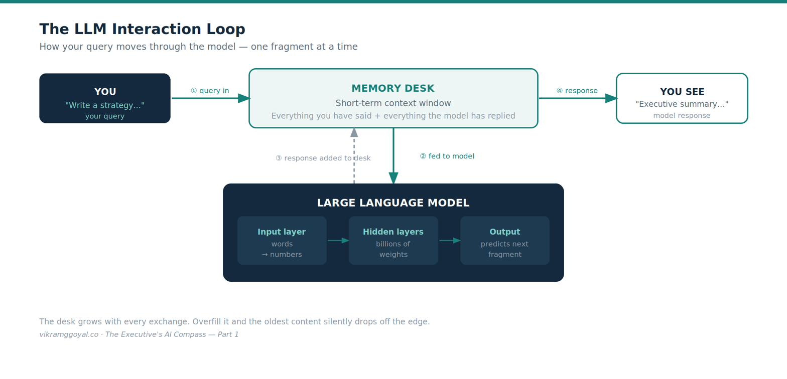
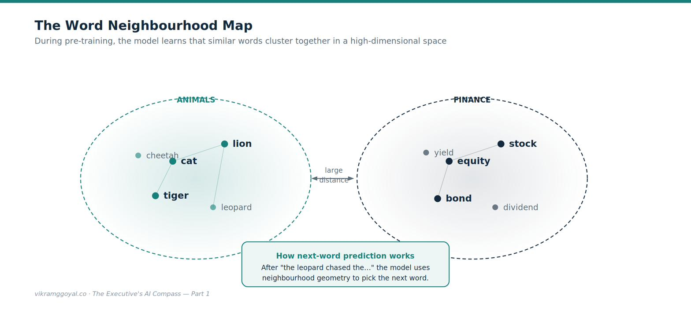
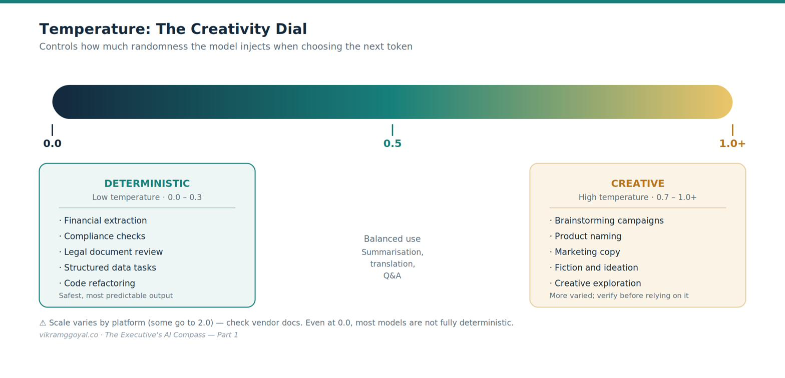
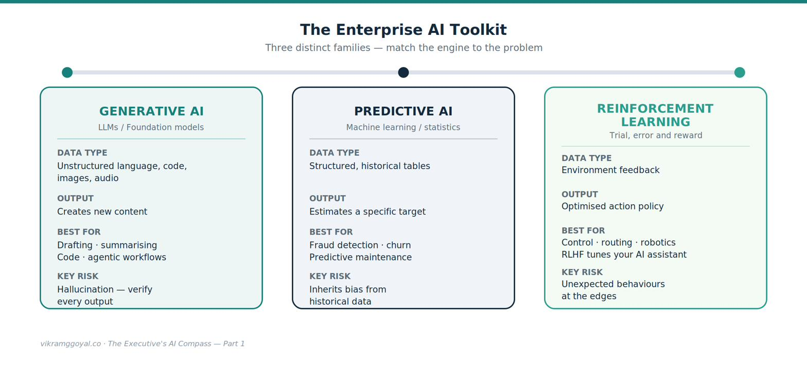



*Views are my own, not those of my employer or clients. Some specifics (model names, regulations) may date over time.*

Being a leader with the mandate to lead, implement, and deliver a robust, enterprise-grade AI strategy, can be a daunting task. You are expected to transform enterprise operational workflows while dodging a minefield of legal, financial, and technical risk. You do not need to be a software engineer or a data scientist to steer this ship. But knowing exactly what your vendors and consultants are talking about - and being able to genuinely partner with them on the solution - unlocks real operational leverage and business impact.

This eight-part series of standalone articles is my attempt to provide fundamental, high-leverage basics required to lead an organisational AI transformation with confidence.

## The eight-part series map

- **Part 1: Demystifying the Digital Brain** — the foundational building blocks: tokens, word maps, memory, parameters, and creativity.
- **Part 2: The Mechanics of Prompting** — how instructions translate into outputs, and how to engineer reliable prompts.
- **Part 3: The Dawn of Agentic AI** — moving beyond a chat box into automated, data-grounded workflows.
- **Part 4: Architectural Fluency** — evaluating vendors, custom builds, cloud service models, regulation, and governance guardrails.
- **Part 5: Leading Enterprise AI Projects** — a fluency framework, an execution playbook, value measurement, and managing human friction.
- **Part 6: The Operating Model** — the talent, roles, and organisational structure that turn individual fluency into institutional capability.
- **Part 7: The Data Foundation** — the data culture, quality, readiness, and strategy that everything else depends on.
- **Part 8: When AI Joins the Management System** — algorithmic management, human-plus-machine "superminds," and how leadership itself changes.
- **Bonus: Downloadable Artefacts for Leading AI Projects** — one-page ready reckoners plus a full AI-project implementation checklist.

---

## Part 1: Demystifying the Digital Brain

If you ask a consultant how a Large Language Model (LLM) works, you will likely get a slide deck of academic jargon that could become overwhelming. One thing we do know, AI is not a mystical mind or a sentient being (not yet!). Reframe your mind to view AI for what it is: a hyper-sophisticated prediction engine that, for example, given a stretch of text, **estimates the most probable next fragment** - and does so repeatedly, one fragment at a time.

A quick but important scoping note: this series concentrates on **generative AI** (the LLMs behind tools like ChatGPT, Claude, and Copilot). Modern systems are increasingly **multimodal** — the same underlying approach now extends to images, audio, and video — but the mechanics below are the right mental model for the language-based tools most executives will govern first.

To visualise how data moves through this engine, look at the core interaction loop:

{fig-alt="Diagram: the LLM interaction loop — query in, model predicts the next fragment, response added to the context window"}

To sit confidently at the table with your technical partners, you need five foundational concepts.

### 1. Tokens: the raw building blocks

AI models do not read text the way humans do. They chop text into fragments called **tokens**, then convert each token into a number, because the model only operates on numbers.

- A useful rule of thumb for English language is that one token is roughly four characters, or about three-quarters of a word.[[1]](#ref-1){.refmark} The exact split depends on the model's tokeniser, so treat this as an estimate, not a law.
- The model uses a built-in vocabulary to map each fragment to a specific token ID.

For example, a phrase like "AI-driven transformation" is split into several fragments, each mapped to a number (e.g., something of the form `<15592> <27233> <11030> <276>`). *These specific numbers are illustrative — the real IDs vary by tokeniser and are not meaningful to a business reader; the point is simply that text becomes numbers.*

**The business impact:** Tokens are the unit of AI economics. Most providers charge by the number of tokens processed - both what you send in and what the model generates.[[1]](#ref-1){.refmark} Bloated, poorly structured prompts and oversized documents translate directly into higher bills, so **prompt discipline is a genuine cost lever.**

### 2. Pre-training: the digital neighbourhood map

How does the model "understand" meaning? During **pre-training**, it reads an enormous volume of text provided to it and learns to represent each token as a set of coordinates in a high-dimensional vector space. Words that appear in similar contexts end up close together — as if grouped into neighbourhoods.

{fig-alt="2. Pre-training: the digital neighbourhood map"}

Because *cat*, *tiger*, and *lion* sit close together, the model treats them as related; *stock* sits far away. When choosing the next token, the model uses this learned geometry to favour words from the relevant region.

**The business impact:** A base model is, in effect, a world-class autocomplete built on public text. It does **not** know your proprietary data, your internal policies, or last week's events. Expecting a raw model to solve your specific corporate problems out of the box will be like hiring a brilliant graduate and giving them zero onboarding. (In Part 3 and Part 4, I cover how you supply that missing context safely.)

### 3. The context window: the short-term storage desk

An LLM's **context window** is its **working memory** for a single conversation — the buffer "storage desk" between you and the model, holding your prompt plus everything exchanged so far between you and the AI model.

- Early models had small storage desks (a few pages of text).
- Modern enterprise models have large storage desks, letting you drop in lengthy contracts or ledgers within a single prompt.

**The business impact:** If your team feeds the model more than the desk holds, it ***typically does not error out — it summarises the oldest content, retains only the summary, and drops the details.*** Worse, models can also lose track of information buried in the *middle* of a very long input.[[2]](#ref-2){.refmark} Managing what goes on the desk - and where - is critical to avoiding silent blind spots.

### 4. Parameters and weights: the knobs of knowledge

A model's scale is measured in **parameters** - the internal connections learned during training - and **weights**, the values that set how strong each connection is. Flagship models have billions to over a trillion of these.

**The business impact:** More parameters generally mean stronger reasoning, but also more compute and higher cost to run. For routine tasks like sorting customer emails, a small, fast, cheap model is often ideal; for heavy strategic analysis, a large flagship model earns its keep. **Matching model size to the job is one of your core cost-optimisation levers.**

### 5. Temperature: dialling creativity vs. predictability

Many AI tools expose a **temperature** setting that governs how much *randomness* the model injects when choosing the next token. Lower means more predictable; higher means more varied.

- **Low temperature:** strict and repeatable — the model favours the safest, most obvious continuations.
- **High temperature:** more exploratory and creative — the model is willing to take less likely paths.

{fig-alt="Diagram: the temperature scale from deterministic and strict to creative and unpredictable"}

*A note on the numbers: some platforms scale temperature from 0 to 1, others from 0 to 2, so the exact figure isn't portable — check your AI model provider's documentation.[[3]](#ref-3){.refmark} The principle holds everywhere. Some newer models do not allow the temperature to be changed and may give errors.*

**The business impact:** The wrong setting quietly breaks deployments. A high temperature on a finance task invites invented figures; a temperature of zero on marketing copy produces something mechanical. Even at low temperatures, remember that most generative models are not fully deterministic — the same prompt can yield slightly different answers on different runs.

---

## A crucial distinction: generative, predictive — and reinforcement learning

Before moving on, master one line that MIT Sloan Management Review calls a matter of "matching the technology to the specific business problem":[[4]](#ref-4){.refmark} the difference between **generative AI** and **predictive AI** — with a third family, **reinforcement learning**, worth recognising to complete the picture.

{fig-alt="A crucial distinction: generative, predictive — and reinforcement learning"}

- **Generative AI** works with unstructured language, text, and code. It *creates* new content, and its output is inherently variable. It excels at summarising, drafting, writing code, and orchestrating agentic workflows. It is not a calculator.
- **Predictive AI** works with structured tables and statistical history. It *estimates a specific quantity or label* - a churn probability, a credit-risk score, next month's demand, a **fraud** flag, or a **predictive-maintenance** warning that a machine is about to fail. Predictive models are **not** simply "deterministic." They produce calibrated probabilities and can be uncertain; the real distinction is the type of data and the type of output, not certainty versus creativity.
- **Reinforcement learning (RL)** learns by trial and error against a reward signal, to make sequential decisions in an environment - think control systems, logistics and routing optimisation, robotics, or game-playing. It is rarely a standalone enterprise tool, but you meet it indirectly: *RLHF* (reinforcement learning from human feedback) is part of how the assistants throughout this series are tuned to be helpful.

**Different engines, different risks and opportunities.**  
Generative AI's technical moat is in the breadth - unstructured, creative, language-heavy work at scale - and its risk is variability and hallucination, which makes validation harder.  
Predictive AI's strength is precision - a measurable answer to a specific, narrow question - and its risks are that it needs volumes of clean historical data, which means it can inherit that history's biases, and only answers what it was trained to.  
Matching the engine to the problem is therefore also matching each one's risk profile to the stakes.

Waste usually starts here — forcing a conversational LLM to compute next quarter's inventory, or commissioning a bespoke statistical model to do work a generative assistant could handle. Match the problem to the correct engine. Increasingly, the two are combined inside a single workflow (predict, then generate), which makes knowing the difference more useful, not less.

---

## How to apply this

- In your next AI discussion, ask three sizing questions:  
  *Which model size (and token cost) does this task actually need?*  
  *Is it grounded in our data or leaning on public pre-training?*  
  *Is the temperature right — low for finance and compliance, higher for ideation?*

- When someone proposes AI for a numeric forecast or a risk score, check whether it is really a **predictive** job, not a **generative** one - ***matching the engine to the problem is the cheapest decision you will make.***

## Key takeaways

- An LLM is a **text-prediction engine**, not a mind - it predicts the next fragment, one at a time.
- Five levers govern its cost and behaviour: **tokens** (cost), **context window** (memory), **parameters** (size vs. cost), **temperature** (creativity), and **pre-training** (it knows public data, not yours).
- Match the engine to the problem: **generative** creates from unstructured input; **predictive** estimates from structured history; **reinforcement learning** learns by reward.
- The model is only ever as good as the **data** beneath it — we'll explore this topic in Part 7.

## Your onboarding status

Understanding these five levers and the toolkit's three families does not make you an expert, nor ready to architect a full rollout. What it does give you is a shield against hyperbole and the vocabulary to ask sharp questions about cost, predictability, and memory limits. You are no longer guessing in the dark.

One foundation we have only gestured at — and will return to in Parts 4 and 5, then address in full in Part 7 — is **your data**. Ever heard of ***"Garbage In - Garbage Out"***? It cannot be stressed enough that the value of these tools depends on the quality, accessibility, and governance of the data you feed them. Keep the back of your mind as we proceed.

Next, we look at your primary steering wheel: how you actually talk to the machine to get reliable results. In **Part 2: The Mechanics of Prompting**, we move from casual chat to strict, repeatable instructions that can safely anchor a business process.

---

### References

1. []{#ref-1}OpenAI, "What are tokens and how to count them?" OpenAI Help Center. <https://help.openai.com/en/articles/4936856-understanding-and-counting-tokens>. *(Provider token-pricing and character/word heuristics; figures vary by tokeniser.)*

2. []{#ref-2}Liu, N. F. et al. (2023). "Lost in the Middle: How Language Models Use Long Contexts." <https://arxiv.org/abs/2307.03172> *(Since the release of this paper, contexts have undergone quite an update with relatively large contexts now available.)*

3. []{#ref-3}Anthropic API documentation and OpenAI API reference (temperature parameter ranges and defaults). <https://platform.claude.com/docs/en/api/>; <https://developers.openai.com/api/reference/resources/responses/methods/create> *(Confirm the current range for your specific model.)*

4. []{#ref-4}Ramakrishnan, R. "When to Use GenAI Versus Predictive AI." *MIT Sloan Management Review.* [sloanreview.mit.edu/article/when-to-use-genai-versus-predictive-ai/](https://sloanreview.mit.edu/article/when-to-use-genai-versus-predictive-ai/)

*This article is educational and does not constitute legal, consulting, or financial advice. Product behaviours, pricing, and parameter ranges change frequently — verify specifics against current vendor documentation.*
