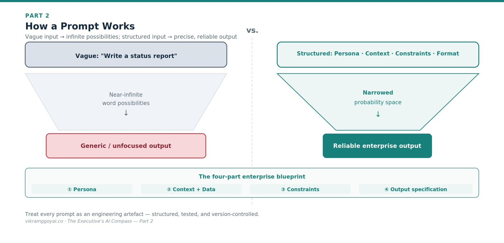



*Views are my own, not those of my employer or clients. Some specifics (model names, regulations) may date over time.*

In Part 1 we examined the building blocks of the digital brain - tokens, word maps, the memory desk, parameters, and the creativity dial - and reframed viewing an AI model as a hyper-sophisticated prediction engine.

**The series map:**

- **[Part 1: Demystifying the Digital Brain](https://vikramggoyal.co/posts/executives-ai-compass-part-1/)**
- **Part 2: The Mechanics of Prompting** *(you are here)*
- **Part 3: The Dawn of Agentic AI**
- **Part 4: Architectural Fluency**
- **Part 5: Leading Enterprise AI Projects**
- **Part 6: The Operating Model**
- **Part 7: The Data Foundation**
- **Part 8: When AI Joins the Management System**
- **Bonus: Downloadable Artefacts for Leading AI Projects**

Now we turn to your primary steering wheel: how you actually talk to the machine to get **reliable, enterprise-grade results.**

---

## Part 2: The Mechanics of Prompting

Early adopters of LLMs coined a flashy phrase - "prompt engineering".

Remember from Part 1, AI models are mathematical probabilistic engines trained on natural language where words are stored in a neighbourhood map. Prompting is directing your AI model to access the correct neighbourhood maps to get you a reliable response.

An LLM does not think, feel, or intrinsically understand your goals. When you write a prompt, you are not having a casual conversation - you are narrowing the mathematical probabilities of what the model produces next. To bridge the gap between casual chat and predictable corporate output, it helps to understand what happens when a prompt is processed.

Worth noting: leading model providers have made prompting far more forgiving than it was in 2023. Clear, well-structured instructions still matter enormously - but the goal today is *reliability and repeatability*.

## How a prompt works, mechanically

When your team submits a prompt, the text becomes tokens and flows into the model's network. Your instructions act like a filter. By supplying a role, vocabulary, constraints, and context, you shift the internal probabilities toward the kind of output you want.

A vague prompt like *"Write a status report"* leaves an enormous field of plausible continuations (probabilities), producing something generic. Structured boundaries narrow that field to a precise, professional target.



## The enterprise prompt blueprint

To help your teams build repeatable workflows rather than play guessing games, enforce a consistent structure. A production-grade prompt has four parts:

1. **Persona - who the model should be acting as in this exercise.** State the role and expertise to assume.
   *Example: "You are a corporate risk auditor specialising in international supply-chain regulation."*
2. **Context and input data - what it needs to know.** Provide the raw material, clearly separated from your instructions using markers or delimiters so the model doesn't confuse data with commands.
   *Example: `[DATA START] …logistics report… [DATA END]`*
3. **Constraints and guardrails - what it must not do.** Set the borders. This is your first line of defence against fabricated information (hallucinations) and scope creep.
   *Example: "Base your analysis strictly on the provided text. If the answer isn't there, state 'Data missing' - do not guess."*
4. **Output specification - how the result should look.** Dictate structure, length, tone, and format so the output slots into your process.
   *Example: "Give a three-bullet executive summary, then a table mapping each risk to its operational impact."*

## Ask for the reasoning: chain-of-thought

For anything involving analysis, multi-step logic, or a judgement, one small instruction reliably improves quality: ask the model to **work through its reasoning step by step** before it gives an answer. This is **chain-of-thought** prompting.

Why it works connects back to Part 1: because the model generates one fragment at a time, forcing it to lay out the intermediate steps gives it a better chance of reaching a sound conclusion - and gives *you* something to inspect. A bare answer hides its logic; a reasoned one exposes it, so an error becomes visible rather than buried.

The executive value is twofold. Accuracy on reasoning-heavy tasks improves; and, more importantly for governance, the visible reasoning is auditable - you can see *why* the model reached a conclusion. One caution: the explanation given by the LLM is a plausible reconstruction, not a literal readout of the model's internals, so treat it as an aid to scrutiny, not proof of the path the model took.

## Beyond instructions: few-shot prompting

If you want the model to match a specific corporate format or brand voice, telling it what to do is often not enough. You have to *show* your desired output.

This is **few-shot prompting**: including two or three examples of ideal input-and-approved-output pairs directly in the prompt. The model infers the pattern from your examples and mirrors the structure and style.[[1]](#ref-1){.refmark} For format-sensitive and style-sensitive tasks, adding examples is one of the most reliable ways to lift output quality without touching the model itself.

> **A note on precision:** You may see confident claims that a technique lifts reliability "from 60% to 95%." Treat such figures with caution - real gains depend entirely on the task, the model, and how you measure success. The honest, defensible statement is that well-chosen examples *substantially and measurably* improve consistency on the tasks they fit. Which brings us to the point most prompt guides skip.

## You cannot trust a prompt you have not tested

A prompt that works once is an anecdote, not a process. Before a prompt anchors anything important, your teams should evaluate it against a small set of representative inputs with known good answers, and re-check it whenever the underlying model is updated, or source data formats are changed - because provider model updates or input data formats can shift behaviour for exactly the same prompts. This habit of systematic verification is the through-line to *Diligence*, one of the four executive competencies I talk about in Part 5.

**The business impact:** A poorly structured prompt demands rounds of manual correction, draining time and compute. Treated as an engineering artefact - structured, exampled, and tested - a prompt becomes a predictable automation block that integrates cleanly into existing workflows. The difference between the two is the difference between a demo and a dependable process.

---

## A reusable prompt template

I personally use this prompt structure as it helps me keep my thoughts structured and get the most out of the models. You can copy, fill in, and reuse this structure for any production task. Complete each tag with the guidance shown, and delete the optional tags you don't need. The more of these you specify, the more reliable and repeatable the output.

```xml
<system_prompt>

  <persona>
    Who the AI should act as - role, seniority, domain expertise, point of view.
    e.g. "A corporate risk auditor specialising in international supply-chain regulation."
  </persona>

  <context>
    <objective>
      The single outcome this prompt must achieve, in one sentence.
    </objective>
    <audience>
      Who will read or use the output, and their level - e.g. "the board; non-technical."
    </audience>
    <background>
      Situational context the model needs: what is happening, why, and any prior decisions.
    </background>
  </context>

  <data>
    The raw material to work from, clearly delimited so it is not mistaken for instructions.
    Paste source text, tables, or documents between the markers.
    [DATA START]
    ...
    [DATA END]
  </data>

  <constraints>
    <data_reach>
      What the model may and may not draw on -
      e.g. "Use ONLY the text in <data>; do not use outside or prior knowledge."
    </data_reach>
    <fact_checking>
      How to handle uncertainty -
      e.g. "If the answer is not in the data, write 'Data missing'. Do not guess or fabricate."
    </fact_checking>
    <scope>
      Boundaries - what is out of scope, what not to do, topic or length limits.
    </scope>
    <safety_and_compliance>
      Privacy, regulatory, or policy rules -
      e.g. "Never reveal PII; flag anything needing legal review."
    </safety_and_compliance>
  </constraints>

  <reasoning optional="true">
    For analysis or judgement tasks: "Work through the reasoning step by step, then give the
    final answer." (Chain-of-thought - improves accuracy and makes the logic auditable.)
  </reasoning>

  <examples optional="true">
    Few-shot: 1–3 pairs of ideal input and approved output, to lock format and voice.
    Omit for simple tasks.
    <example>
      <input>...</input>
      <output>...</output>
    </example>
  </examples>

  <output_specification>
    <sample_output optional="true">
      A skeleton or exact template of the desired response, if a specific structure is
      required; the model will mirror it.
    </sample_output>
    <format>
      Structure - e.g. "Three-bullet executive summary, then a table of risk → impact."
    </format>
    <length>
      Size limits - e.g. "Under 200 words" or "one page."
    </length>
    <tone>
      Voice and register - e.g. "Formal, precise, board-appropriate; no marketing language."
    </tone>
    <references>
      Whether and how to cite - e.g. "Cite the source line for every claim, as [Doc, p.3]."
    </references>
  </output_specification>

</system_prompt>
```

Read it against the four blueprint parts above: `<persona>`, `<context>` + `<data>`, `<constraints>`, and `<output_specification>` are the core; `<reasoning>` and `<examples>` add the chain-of-thought and few-shot techniques when a task needs them.

## Key takeaways

- Start from the **reusable prompt template above** - fill each tag, and delete the optional ones you don't need.
- Prompting is **programming a probabilistic system in natural language** - structure narrows the output.
- A production prompt has four parts: **persona, context/data, constraints, output specification.**
- For reasoning tasks, ask for step-by-step reasoning (**chain-of-thought**); to match a format or voice, show 2–3 examples (**few-shot**).
- A prompt isn't trusted until it's **tested** against known-good cases - and re-tested whenever the model updates or data format changes.

## Your onboarding status

You now know that the consistency of an AI's output depends chiefly on the structure of its input - and that a prompt earns trust only once it has been tested. You can look at a team's prompt and diagnose why a system is giving erratic answers.

But individual prompts, however well-engineered, still depend on a human pressing "enter" every time. To scale automation, we connect these prompt blocks into automated ecosystems - and give them access to your live, proprietary data.

In **Part 3: The Dawn of Agentic AI**, we move past single prompts into environments where specialised AI components retrieve real data, cooperate, check one another, and execute multi-step business goals with a human firmly in the loop.

---

### References

1. []{#ref-1}Brown, T. et al. (2020). "Language Models are Few-Shot Learners." <https://arxiv.org/abs/2005.14165> *(The foundational demonstration that in-context examples improve task performance.)*

*This article is educational and does not constitute legal or financial advice. Model behaviours change frequently - verify specifics against current vendor documentation and test prompts on your own data.*
