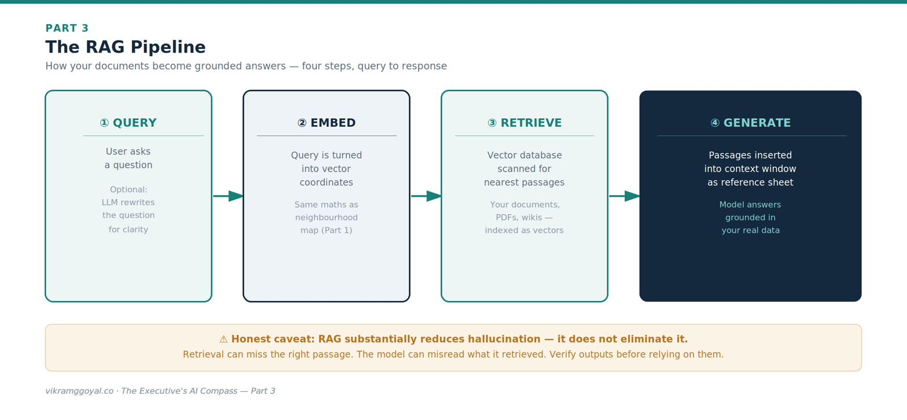
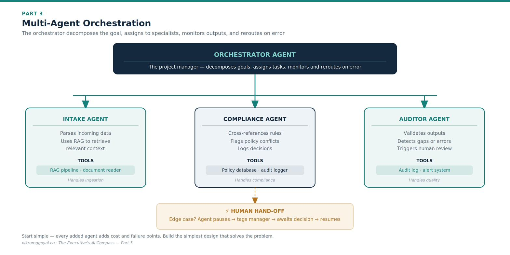



*Views are my own, not those of my employer or clients. Some specifics (model names, regulations) may date over time.*

In Part 2 we established prompt engineering as the disciplined programming directing a probabilistic text engine (LLM) using natural language - structured, exampled, and tested.

**The series map:**

- **[Part 1: Demystifying the Digital Brain](https://vikramggoyal.co/posts/executives-ai-compass-part-1/)**
- **[Part 2: The Mechanics of Prompting](https://vikramggoyal.co/posts/executives-ai-compass-part-2/)**
- **Part 3: The Dawn of Agentic AI** *(you are here)*
- **Part 4: Architectural Fluency**
- **Part 5: Leading Enterprise AI Projects**
- **Part 6: The Operating Model**
- **Part 7: The Data Foundation**
- **Part 8: When AI Joins the Management System**
- **Bonus: Downloadable Artefacts for Leading AI Projects**

Now we take a structural leap. Individual prompts are useful for personal productivity, but they have two operational limits: they don't know your fresh, proprietary data, and they rely on a human sitting at a keyboard for every step. To scale AI across an enterprise, we introduce **RAG** and step into **Agentic AI**.

---

## Part 3: The Dawn of Agentic AI

If your AI strategy consists entirely of employees typing questions into standalone chat screens, you are using a Ferrari to visit the corner shop. You are capturing a fraction of the technology's value and potential.

To unlock more, we first solve the model's biggest blind spot: on its own, the LLM only knows what it learnt during pre-training. It has no knowledge of yesterday's events, nor of your internal files and assets.

## The anatomy of RAG

To ground a model in your organisation's truth, technical teams deploy **Retrieval-Augmented Generation (RAG)** - an approach introduced in 2020 to let models pull in external knowledge at query time rather than relying only on what they were trained on.[[1]](#ref-1){.refmark} Think of it as shifting the model from a closed-book exam to an open-book one.

Instead of matching keywords like an old search engine, RAG converts your documents - PDFs, spreadsheets, wikis - into token-based coordinates and stores them in a specialised **vector database**, using the same "neighbourhood map" geometry we met in Part 1. A user's question is converted the same way, and the system retrieves the passages whose coordinates sit closest to it.

The canonical pipeline has four steps:

1. **Query.** The user asks a question. (Some systems first use an LLM to rewrite a messy question into a cleaner search phrase - a helpful refinement, not a required step.)
2. **Embed.** The query is converted into vector coordinates.
3. **Retrieve.** The system scans the vector database and returns the passages nearest to the query.
4. **Generate.** Those retrieved passages are inserted into the model's context window as a reference sheet, and the model composes its answer grounded in them.

**An honest caveat for the boardroom:** RAG *substantially reduces* fabrication (hallucination) by giving the model real source text to work from - but it does not eliminate it. Answers can still be wrong if retrieval misses the right passage or if the model misreads what it retrieved. Grounding raises the floor; it does not remove the need for the verification habits we'll cover in Part 5. (Security and access controls around what RAG is allowed to retrieve are a governance topic we treat in Part 4.)
*Technical implementation of RAG deserves a separate article of its own, and has been left out from here.*

## Stepping into the agentic shift

RAG on its own is powerful but passive - it looks things up. The operational shift comes when you combine RAG with **AI agents**.

An AI agent is an LLM configured with an objective, a set of instructions, and the autonomy to choose its own steps, call software tools, and execute multi-step workflows. Instead of writing one prompt and waiting, you deploy something closer to a small digital team.

### 1. Multi-agent orchestration (the digital manager)

In a mature setup you don't deploy a lone agent; you build a framework coordinated by an **orchestrator**.

The orchestrator decomposes a high-level goal into a checklist, assigns tasks to specialised sub-agents, monitors their outputs, and reroutes work when one hits an error. A useful executive caveat: more agents mean more moving parts, more cost (tokens), and more places for errors to compound - so start with the simplest design, a flexible yet scalable framework, that solves the problem, not the most elaborate.

### 2. Agentic RAG (dynamic problem-solving)

Standard RAG is a single pass: ask, retrieve, answer. **Agentic RAG** adds active reasoning. Asked to compile a regional risk report, the agent notices a missing piece after its first retrieval, formulates a new query, searches a different source, cross-references, and iterates until its evidence looks complete - much closer to how an analyst actually works.

### 3. Human-to-agent hand-off (the two-way street)

The aim of agentic AI is not to remove the human but to pair human judgment with machine volume - **bi-directional collaboration**. When a pipeline hits an unprecedented edge case that breaks its rules, a well-designed agent does not fabricate an answer or crash. It pauses, tags a human with a crisp summary of the conflict, waits for a decision, records the resolution, and resumes. Designing these hand-off points - and deciding which decisions *must* route to a human - is one of your most important governance choices, and we will formalise it in Part 4.

**The business impact:** Moving from isolated prompts to agentic, RAG-grounded pipelines shifts your workforce from operational doers toward system architects - less time hunting for data in messy directories, more time refining the automated pipelines that drive the enterprise. The prize is real; so is the added complexity, which is exactly why the next two parts are about controlling it.

---

## Key takeaways

- **RAG** grounds a model in your data (query → embed → retrieve → generate) - it reduces hallucination but does not eliminate it.
- An **agent** adds autonomy: an objective, tools, and multi-step execution; an **orchestrator** coordinates specialised sub-agents.
- Start with the **simplest design that works, within a flexible and scalable framework** - more agents mean more cost and more places for errors to compound.
- Build in **human hand-off points**, and decide up front which decisions must route to a person.
- Build for the process and challenge your business teams to rethink the process.

## Your onboarding status

You now understand how retrieval, tool use, and multi-agent coordination turn AI from a desktop assistant into a scalable digital workforce - and where its honest limits lie. You can challenge your teams on how they connect individual prompts into autonomous, data-grounded pipelines, and on how those pipelines fail safely.

But to deploy these systems responsibly, you must understand the structural options. Do you buy a packaged tool, build a custom solution, or extend a frontier model through the cloud? And how do you keep any of it compliant?

In **Part 4: Architectural Fluency**, I make an attempt to demystify the enterprise tech stack - including the regulatory landscape and the governance "harness" - so you can judge data-privacy boundaries, vendor lock-in, security exposure, and total cost of ownership.

---

### References

1. []{#ref-1}Lewis, P. et al. (2020). "Retrieval-Augmented Generation for Knowledge-Intensive NLP Tasks." <https://arxiv.org/abs/2005.11401> *(The paper that introduced RAG.)*

*This article is educational and does not constitute legal or financial advice. Architectural patterns and tooling evolve quickly - verify specifics against current vendor documentation.*
