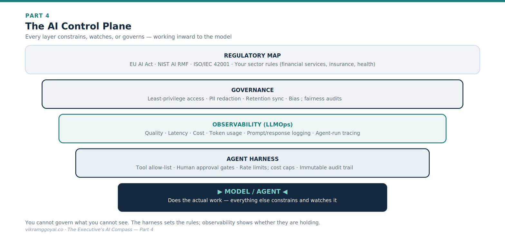



*Views are my own, not those of my employer or clients. Some specifics (model names, regulations) may date over time.*

In Part 3 we made the jump from single prompts to autonomous, RAG-grounded agentic pipelines - where specialised agents cooperate, draw on your internal knowledge, and handle heavy workflows while a human stays accountable.

**The series map:**

- **[Part 1: Demystifying the Digital Brain](https://vikramggoyal.co/posts/executives-ai-compass-part-1/)**
- **[Part 2: The Mechanics of Prompting](https://vikramggoyal.co/posts/executives-ai-compass-part-2/)**
- **[Part 3: The Dawn of Agentic AI](https://vikramggoyal.co/posts/executives-ai-compass-part-3/)**
- **Part 4: Architectural Fluency** *(you are here)*
- **Part 5: Leading Enterprise AI Projects**
- **Part 6: The Operating Model**
- **Part 7: The Data Foundation**
- **Part 8: When AI Joins the Management System**
- **Bonus: Downloadable Artefacts for Leading AI Projects**

Now that you know what the technology can do, you face a different bottleneck: how do you buy, build, and govern it safely - and legally? That requires **architectural fluency**.

---

## Part 4: Architectural Fluency

Two of the most expensive mistakes in enterprise AI are architectural: spending millions to custom-build what you could have rented, and shipping a clever pipeline that triggers a regulatory breach because no one governed it. Both trace to the same gap - leaders who can't yet judge *how* AI is bought, built, and controlled. Closing that gap is architectural fluency, and it is what keeps a steering-committee decision from becoming a write-off.

Every vendor will insist their delivery model is the only sensible choice. SaaS companies pitch plug-and-play simplicity; cloud giants pitch their ecosystem; custom shops insist a bespoke build is the only way to protect your edge. You do not need to pick a cloud provider or read application code - but you must understand the three strategic paths - **Buy, Extend, Build** - and the governance controls that keep you out of trouble.

| Strategic path | What it means | Speed to value | Cost structure | Privacy & control |
|---|---|---|---|---|
| **1. Buy (SaaS AI)** | Rent pre-built AI apps (e.g., Microsoft Copilot, Salesforce Einstein) | Fast (days–weeks) | Predictable per-user subscription (However, now-a-days, you'll see a hybrid model of fixed fee and token usage fees) | Lower control; data boundaries set by the vendor's terms |
| **2. Extend (Cloud APIs)** | Route your data to a frontier model (e.g., OpenAI, Anthropic, Google) via a cloud API | Moderate (weeks–months) | Consumption-based (pay per token) | Good under an enterprise/API agreement, which typically excludes your data from training |
| **3. Build (Custom / open-weights)** | Host an open-weights model (e.g., Meta's Llama, Mistral) on infrastructure you control | Slow (months) | High upfront engineering and ongoing compute | Highest; data can stay entirely within your perimeter |

Most enterprises end up with a *portfolio* across all three - buying for commodity tasks, extending for flexible workhorse use cases, and building only where control or differentiation truly justifies it.

## Data isolation vs. public AI - stated precisely

Data leakage panics boards, so be precise about the actual risk. The important distinction is **which agreement and settings you are operating under**, not "cloud versus not":

- **Consumer tiers** of public chat tools *may* use your inputs to improve their models, depending on the provider and your account settings - some let you opt out, some don't.
- **Enterprise and API agreements** from the major providers typically state contractually that your prompts and outputs are **not** used to train their models, and are retained only briefly (or not at all) for abuse-monitoring.

The executive action is not "ban public tools" but "route corporate data only through agreements you have actually read, and confirm the data-use and retention terms in writing." Terms differ by vendor and change over time, so verify the current contract rather than relying on reputation.

## The regulatory landscape you are now accountable for

A gap most technology briefings skip: AI is now **regulated**, and the accountability often sits with the business, not the vendor. You don't need to be a lawyer, but you should know the landmarks and ask your legal and risk teams where you stand against them.

- **Sector rules you already live under** - in financial services, insurance, and healthcare, existing regulators are extending model-risk, fairness, and consumer-protection expectations to AI. Assume your existing obligations apply to AI unless told otherwise.  
*A quick web search will give you a few of the most relevant and comprehensive AI regulations/guidelines that already exist.*
- **The EU AI Act** - the first comprehensive, risk-tiered AI law, which bans certain uses outright and imposes strict obligations on "high-risk" systems (which include many uses in credit, insurance, employment, and other regulated decisions). Its obligations phase in over time, so confirm which requirements apply to you and by when.[[1]](#ref-1){.refmark}
- **The NIST AI Risk Management Framework (AI RMF)** - a voluntary US framework widely used as a practical backbone for governing AI risk.[[2]](#ref-2){.refmark}
- **ISO/IEC 42001** - the international management-system standard for AI, increasingly requested in enterprise procurement and audits.[[3]](#ref-3){.refmark}

**The point:** "The vendor handles compliance" is rarely true for how *you* deploy a system. Make regulatory mapping a named step in every AI project, not an afterthought.

## The AI control plane: the "harness"

Even with data isolated, autonomous agents and internal RAG stores create a new problem: because they are probabilistic, the same agent can behave differently from one run to the next. To contain that variability, enterprises deploy an **agent harness** - an infrastructure "cage" that defines access boundaries, limits which tools an agent may call, enforces human-approval gates, and produces an audit trail showing exactly why an agent took each action. The harness governs what an agent *may* do; **observability** tells you what it *actually* did and how well - continuous monitoring of quality, latency, cost, and usage, with logging and tracing that make every run inspectable. You cannot govern what you cannot see, so treat both as standard infrastructure.

Picture the controls in this part as a stack wrapped around the model: the model does the work at the core, and each layer constrains, watches, or governs what it can do.

{fig-alt="Diagram: the AI control plane - regulatory map, governance, observability, and agent harness layers wrapped around the model/agent at the core"}

## A new class of risk: AI-specific security threats

Traditional security assumes software follows fixed instructions. AI systems can be manipulated through their *inputs*, which introduces threats your existing controls may not catch. At minimum, ask your teams how they defend against:

- **Prompt injection** - malicious instructions hidden inside a document, email, or web page that an agent reads, hijacking its behaviour.
- **Data poisoning** - corrupting the data a model or RAG index learns from, to skew its outputs.
- **Sensitive-data leakage** - an over-permissioned agent surfacing information a user should never have seen.

These are not reasons to avoid AI; they are reasons to insist on the harness and the governance below.

## The executive governance checklist

If your teams host RAG systems or deploy agents, hold them to a human-centred audit. Do not accept a "black box." Demand answers to four questions:

1. **Is only what's needed exposed to the model?**\
   *Risk:* An agent can read anything placed in its context. Point it at your whole corporate drive and an HR agent might scrape payroll or an unannounced roadmap.\
   *Control:* Enforce **least-privilege** access at the data-source level. If a human isn't authorised to see a file, the agent must be blocked from it too.

2. **Is personal data properly protected?**\
   *Risk:* Passing raw personally identifiable information (PII) into a pipeline risks regulatory breaches.\
   *Control:* Mandate an automated redaction/tokenisation layer that masks sensitive fields *before* text leaves your internal systems (e.g., "John Doe, SSN 123-45-…" → "[REDACTED_NAME], [REDACTED_ID]").

3. **Is data retention enforced?**\
   *Risk:* Vector indexes create long-lived copies of your data. If policy says purge customer records after a set period but they persist in the AI index, you are out of compliance.\
   *Control:* Build automated purging that keeps the AI index synchronised with your deletion schedules.

4. **Are we monitoring for bias and behaviour?**\
   *Risk:* Trained on historical data, models can inherit historical bias. An unchecked screening or eligibility agent can make unfair, non-compliant decisions at scale.\
   *Control:* Enforce continuous audit trails and run regular, automated fairness checks against agent output logs.

**The business impact:** Architectural fluency protects you from two terminal mistakes - spending millions to custom-build what you could have rented, or facing regulatory and reputational damage because a clever pipeline shipped without a governance plane, a compliance map, or defences against AI-specific attacks.

---

## Key takeaways

- Three paths - **Buy** (SaaS), **Extend** (cloud API), **Build** (open-weights); most enterprises run a **portfolio** of all three.
- Data safety is about the **agreement and settings**, not "cloud vs. not" - enterprise/API terms typically exclude your data from training.
- **You** are accountable for regulation - the vendor rarely is.
- Wrap the model in a **control plane**: harness, observability, least-privilege access, PII redaction, bias audits - and defend against prompt injection.

## Your onboarding status

You can now sit with your technology steering committee and read an AI proposal with strategic and compliance clarity. You understand the trade-offs between renting, extending, and building; the regulatory landmarks you're accountable for; the AI-specific security threats to defend against; and how to hold teams accountable for least-privilege access, data protection, audit trails, and a governance harness.

You now have the full baseline - the machine, the prompt, the agentic pipeline, and the architectural and regulatory rails. What remains is execution.

In **Part 5: Leading Enterprise AI Projects**, I attempt to turn all of this into a concrete playbook: a fluency framework for leading AI teams, a way to prioritise and measure value, and a practical approach to the human friction that derails most initiatives.

---

### References

1. []{#ref-1}Regulation (EU) 2024/1689 (the "EU AI Act"), Official Journal of the European Union. <https://eur-lex.europa.eu/eli/reg/2024/1689/> *(Obligations phase in on a staggered timeline.)*

2. []{#ref-2}National Institute of Standards and Technology (2023). *AI Risk Management Framework (AI RMF 1.0).* <https://www.nist.gov/publications/artificial-intelligence-risk-management-framework-ai-rmf-10>

3. []{#ref-3}ISO/IEC 42001:2023, *Information technology - Artificial intelligence - Management system.* <https://www.iso.org/standard/42001>

*This article is educational and does not constitute legal advice. AI regulation is evolving rapidly and varies by jurisdiction - confirm current obligations with qualified legal and risk professionals.*
