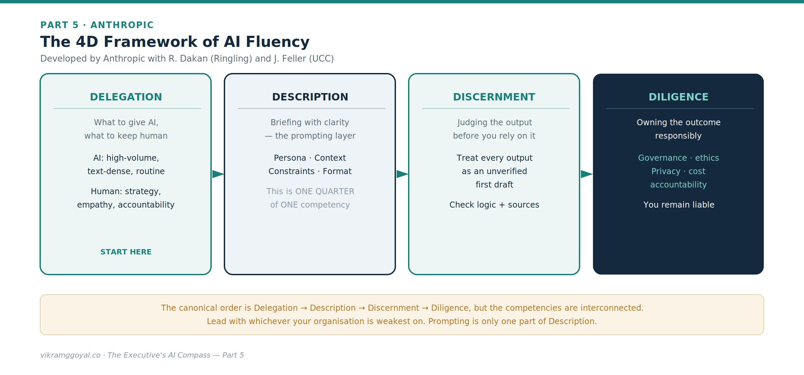
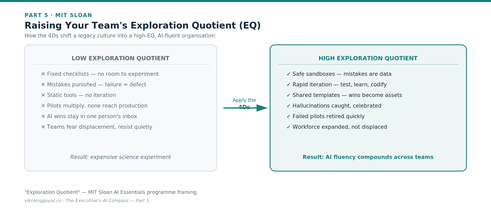



*Views are my own, not those of my employer or clients. Some specifics (model names, regulations) may date over time.*

In Part 4 we looked at the enterprise tech stack - buy, extend, or build - and locked it down with a regulatory map, AI-specific security awareness, and a governance harness.

**The series map:**

- **[Part 1: Demystifying the Digital Brain](https://vikramggoyal.co/posts/executives-ai-compass-part-1/)**
- **[Part 2: The Mechanics of Prompting](https://vikramggoyal.co/posts/executives-ai-compass-part-2/)**
- **[Part 3: The Dawn of Agentic AI](https://vikramggoyal.co/posts/executives-ai-compass-part-3/)**
- **[Part 4: Architectural Fluency](https://vikramggoyal.co/posts/executives-ai-compass-part-4/)**
- **Part 5: Leading Enterprise AI Projects** *(you are here)*
- **Part 6: The Operating Model**
- **Part 7: The Data Foundation**
- **Part 8: When AI Joins the Management System**
- **Bonus: Downloadable Artefacts for Leading AI Projects**

Now we bring it together: how you actually lead, prioritise, measure, and deliver an AI initiative without stalling in endless pilots or alienating your people.

---

## Part 5: Leading Enterprise AI Projects

The paradox of this era is that as the technology grows more powerful, project success depends *less* on the code and more on your leadership. You can license a trillion-parameter model and hire the best engineers, but without a clear leadership approach the effort stalls as an expensive science experiment.

You don't need a data-science degree. You need three things: a way to **choose** the right work, a way to **lead** it, and a way to **measure** it.

## First, choose the right work: a simple prioritisation lens

Before any framework for *how* to work with AI, decide *where* to point it. A pragmatic filter is aligning AI to business goals and to your data readiness[[1]](#ref-1){.refmark}[[2]](#ref-2){.refmark}. Score your use cases on four questions:

1. **Value** - if this worked, how much does it move a real business metric?
2. **Feasibility** - do we have the data, and is the task a good fit for today's AI?
3. **Risk** - what's the downside if it's wrong, and how regulated is the decision?
4. **Readiness** - is the underlying data accessible, clean, and governed?

Fund a small number of high-value, high-feasibility, manageable-risk use cases with ready data. Park the rest. This single discipline prevents the most common failure mode: a scatter of pilots that never reach production.

## Second, lead the work: the 4D framework of AI fluency

To steer AI-augmented teams, a widely adopted model is the **4D Framework of AI Fluency**, developed by Anthropic with Professors Rick Dakan (Ringling College of Art and Design) and Joseph Feller (University College Cork).[[3]](#ref-3){.refmark} Its four competencies - **Delegation, Description, Discernment, and Diligence** - describe the skills of working well with AI, of which prompting is only one part.

{fig-alt="Diagram: the 4D Framework of AI Fluency - Delegation, Description, Discernment, Diligence - developed by Anthropic with R. Dakan (Ringling) and J. Feller (UCC)"}

- **Delegation.** Leading with AI begins with deciding what to hand over to the AI and what to keep with humans. AI excels at high-volume, text-dense work, extraction, and rapid drafting. You cannot delegate ultimate accountability, core strategy, or human empathy. Fluency starts by separating machine labour from human judgment.
- **Description.** Because these are probabilistic systems, you program them with clear language, as we explored with prompting in Part 2 - persona, context, constraints, and output format. This is where prompting lives; note that it is *one quarter of one* competency, not the whole game.[[3]](#ref-3){.refmark}
- **Discernment.** Treat every output as an unverified first draft. Because these engines work on probability rather than database lookups, they can be confidently wrong. Discernment is the habit of checking the logic and the sources before you sign off.
- **Diligence.** The responsibility layer: governance, ethics, transparency, and owning the outcome - knowing when a model is "good enough," managing token cost, and honouring the data-privacy and regulatory obligations from Part 4.

> **A note on order:** Anthropic's canonical sequence is Delegation → Description → Discernment → Diligence. The competencies are interconnected rather than strictly sequential, so lead with whichever your organisation is weakest on.

## Turning the 4Ds into a culture: Exploration Quotient (EQ)

MIT Sloan in its *AI Essentials* programme frames a related idea: helping leaders raise the **Exploration Quotient (EQ)** of their teams - their capacity to run structured experiments and adopt AI, rather than merely use a tool once.[[1]](#ref-1){.refmark} The implementation methodology for development will need a renewed outlook where a feature failure is reviewed, reiterated with incremental changes until the outcome is reached.

{fig-alt="Diagram: raising your team's Exploration Quotient - applying the 4Ds shifts a legacy culture from low EQ (fixed checklists, punished mistakes, pilots that never reach production) to high EQ (safe sandboxes, rapid iteration, shared templates, workforce expanded not displaced)"}

Here is how to use the 4Ds to raise EQ:

1. **De-risk with sandbox delegation.** Stand up isolated, internal spaces and say plainly: *"Mistakes in the sandbox are data, not failures."* Psychological safety is what lets teams explore where the model fits.
2. **Turn discovery into description.** When someone finds a prompt or workflow that removes a bottleneck, require them to codify it as a shared, tested corporate template. Personal breakthroughs become organisational assets.
3. **Reward audited failure via diligence.** Celebrate the people who *catch* model mistakes. Run reviews that showcase hallucinations that were caught. This turns verification from a chore into a badge of honour.
4. **Drive strategic discernment.** Use your leadership lens to review these bottom-up experiments, retire low ROI failed pilots quickly, and double down only on the high-leverage workflows that pass your governance and compliance checks.

## Third, measure the work: proving value without fooling yourself

Part 4 promised a way to track return, and this is where most initiatives get vague. Set the measurement *before* you build, not after:

- **Define the metric up front.** Tie each use case to a specific business number - hours saved, cycle time, error rate, conversion, cost-to-serve - agreed with the existing process owner.
- **Take a baseline.** You cannot claim improvement you never measured against.
- **Account for the full cost.** True cost of ownership is not just licences or tokens; it includes integration, maintenance, model updates, and - critically - the human oversight the governance layer requires.
- **Run a fair comparison.** A/B or before/after against the baseline, on real work, not a demo.
- **Watch for value decay.** Model updates and data drift can erode performance over time, so measurement is ongoing, not a one-off sign-off.

**Observability makes all of this possible.** None of the above works if you cannot *see* the system running in production. Insist on **observability** - the operational instrumentation that continuously tracks quality, latency, cost, and token usage, logs prompts and responses, traces multi-step agent runs, and raises alerts when quality drifts. In the AI world this discipline is often called *LLMOps*, and it is the plumbing behind everything on this list: without it, decay is invisible until a customer finds it, and your value claims rest on a demo rather than live evidence. Treat it as day-one infrastructure, not a phase-two nicety.

A use case that can't name its metric, its baseline, and its full cost is not ready for funding.

## Package it as a business case

Prioritisation, the 4Ds, and honest measurement all feed one deliverable: the **business case** you use to secure funding. In my opinion, a credible AI business case has five parts, *a case that lists only the upside is a pitch, not a business case*.

1. **Value** - the specific metric it moves and the size of the prize, straight from your prioritisation lens.
2. **Strategic alignment** - how it advances a stated business objective or competitive position, not just efficiency for its own sake.
3. **Cost** - the full total cost of ownership: build, integration, licences and tokens, maintenance, and the human oversight governance requires.
4. **Risk** - the honest downside across data, regulatory, security, and delivery, with a mitigation named for each.
5. **Roadmap** - a phased path from a bounded pilot to scaled deployment, with the stage gates and the kill criteria set out up front.

The value and the risk, the prize and the full cost, belong on the same page.

## Overcoming the human friction

The real hurdle is rarely the technology - it is people. Introduce an AI initiative and a quiet anxiety wave follows: fear of displacement, devaluation, obsolescence. A workforce that fears replacement will subtly resist - degrading inputs, ignoring the harness, skipping the diligence the system depends on.

Raising EQ lets you reframe the narrative from cost-cutting to capacity augmentation. AI fluency is not about shrinking headcount; it is about freeing human talent from administrative quicksand so people can apply the judgment only they possess. That reframing, made credibly and backed by how you actually treat early experiments, is often the decisive factor between adoption and quiet sabotage or disengagement.

**The final business impact:** Knowing your AI means you stop treating these projects as IT upgrades and start treating them as structural realignments. By choosing the right work, leading it with the 4Ds, raising your team's EQ, and measuring value honestly, you move from passive bystander to deliberate architect of a smarter, faster, more effective enterprise.

---

## Key takeaways

- **Choose** the work with a value / feasibility / risk / readiness lens - fund a few, park the rest.
- **Lead** it with the 4Ds: Delegation, Description, Discernment, Diligence.
- Raise your team's **Exploration Quotient** - treat sandbox mistakes as data, not failures.
- **Measure** honestly - metric, baseline, full TCO, fair comparison, and observability to catch decay - then package it as a **business case**.

## Your onboarding status

You now have the personal leadership toolkit: how to choose the right work, lead it with the 4Ds, raise your team's Exploration Quotient, and measure value without fooling yourself. You understand the digital brain, the anatomy of a prompt, agentic and RAG-grounded systems, and the architecture and regulation of the stack.

But individual fluency, however strong, does not survive contact with a large organisation unless the organisation is built to hold it. Who owns AI? Where do the skills come from? How do you structure teams so that good practice spreads instead of stalling in one enthusiast's inbox?

In **Part 6: The Operating Model**, we turn personal fluency into institutional capability - the talent strategy, the roles, and the organisational design that let an enterprise run AI at scale, safely and repeatedly.

---

### References

1. []{#ref-1}MIT Sloan Executive Education, *AI Essentials: Accelerating Impactful Adoption* (Source of the "Exploration Quotient / EQ" framing and the emphasis on AI strategy and data). <https://executive.mit.edu/course/ai-essentials/a05U1000009xGLJIA2.html>

2. []{#ref-2}Wharton Executive Education, *AI for Business* / *Leadership Program in AI and Analytics* (aligning AI to business value, governance, and data-driven decisions). <https://executiveeducation.wharton.upenn.edu/online-learning/self-paced-online-programs/leadership-program-in-ai-and-analytics/>

3. []{#ref-3}Anthropic, with R. Dakan and J. Feller, "AI Fluency: Framework & Foundations" - the 4D Framework (Delegation, Description, Discernment, Diligence). <https://anthropic.skilljar.com/ai-fluency-framework-foundations>; <https://aifluencyframework.org/>

*This article is educational and does not constitute legal or financial advice. Frameworks are summarised from public descriptions and may be updated by their authors - consult the primary sources for details.*
