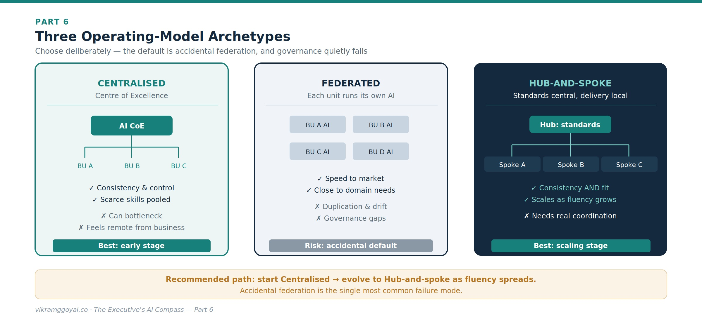
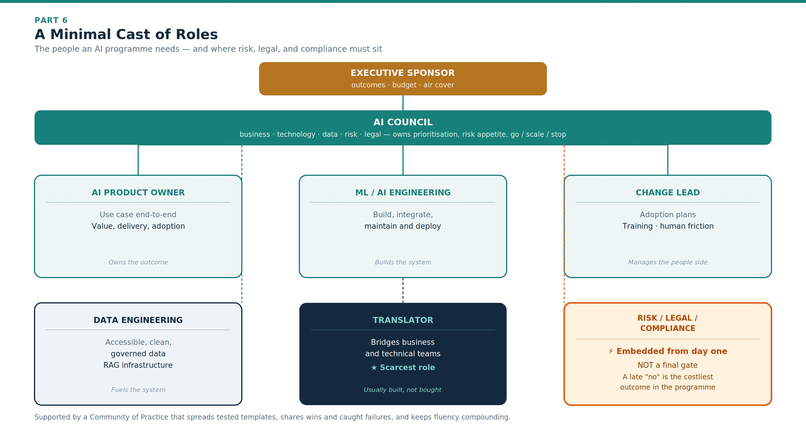
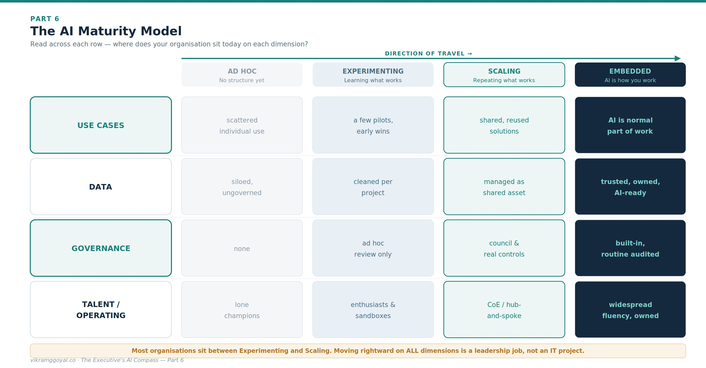



*Views are my own, not those of my employer or clients. Some specifics (model names, regulations) may date over time.*

In Part 5 we assembled the personal leadership toolkit: choosing the right work, leading it with the 4D framework of AI fluency, raising your team's Exploration Quotient, and measuring value honestly.

**The series map:**

- **[Part 1: Demystifying the Digital Brain](https://vikramggoyal.co/posts/executives-ai-compass-part-1/)**
- **[Part 2: The Mechanics of Prompting](https://vikramggoyal.co/posts/executives-ai-compass-part-2/)**
- **[Part 3: The Dawn of Agentic AI](https://vikramggoyal.co/posts/executives-ai-compass-part-3/)**
- **[Part 4: Architectural Fluency](https://vikramggoyal.co/posts/executives-ai-compass-part-4/)**
- **[Part 5: Leading Enterprise AI Projects](https://vikramggoyal.co/posts/executives-ai-compass-part-5/)**
- **Part 6: The Operating Model** *(you are here)*
- **Part 7: The Data Foundation**
- **Part 8: When AI Joins the Management System**
- **Bonus: Downloadable Artefacts for Leading AI Projects**

The lever that decides whether all of this sticks is the organisation itself. Individual fluency does not survive contact with a large enterprise unless the enterprise is designed to hold it. This part is about that design - the talent, the roles, and the structure that turn personal capability into institutional capability.

---

## Part 6: The Operating Model

Most AI initiatives don't fail on the technology. They fail on the org chart. A brilliant pilot lands in one enthusiast's inbox, works beautifully, and then goes nowhere - because no one owns it, no one else has the skills to run it, and there is no structure to spread it. The operating model is how you prevent that.

Three questions sit at the heart of it: **Who owns AI? Where do the skills come from? And how does good practice spread instead of stalling?**

## 1. Who owns AI? Three operating-model archetypes

There is no single correct structure - only trade-offs you should choose deliberately rather than inherit by accident.

- **Centralised (a Centre of Excellence).** A single team owns strategy, standards, tooling, and delivery. Best early on, when skills are scarce and you need consistency and control. The risk is that it becomes a bottleneck and drifts away from what the business actually needs.
- **Federated.** Each business unit builds its own AI capability. Fast and domain-aware, but prone to duplicated effort, inconsistent governance, and quality that varies wildly between teams.
- **Hub-and-spoke.** A lean central hub sets standards, owns shared platforms and governance, and curates reusable assets; "spoke" specialists sit inside business units and deliver in context. For most mid-to-large enterprises this is the pragmatic destination - but it only works if the hub and spokes are genuinely coordinated.

**The business impact:** A common and effective path is to *start centralised* to build standards and scarce skills, then *evolve to hub-and-spoke* as fluency spreads. The mistake is picking a structure by default - usually accidental federation, where everyone does their own thing and governance quietly fails.

## 2. Where do the skills come from? Buy, build, borrow

You will never hire your way to an AI-fluent organisation, and you should not try. Blend three sources:

- **Buy (hire).** Bring in a small number of specialists for genuinely scarce skills - ML engineering, data engineering, AI risk. Hire deliberately and don't over-index on it; specialists are expensive and scarce.
- **Build (upskill and reskill).** This is the largest and most durable lever. Systematically raise fluency across the existing workforce - the 4Ds and the sandbox culture from Part 5 are your curriculum. Reskilling is also your most credible answer to the workforce anxiety we discussed: you are visibly investing in people, not replacing them.
- **Borrow (partners and vendors).** Use consultancies and vendors to accelerate, to access specialist skills you don't yet have, and to de-risk early builds - but on your terms (see below). Do not underestimate the speed at which the AI landscape is evolving - vendors and partners heavily invest on talent upskilling, and you get to leverage them as soon as the AI landscape changes.

### The role most organisations forget: the translator

The scarcest and highest-leverage capability is rarely the deep technical specialist. It is the **translator** - the person who understands the business problem *and* enough of the technology to broker between domain experts and engineers, spot which use cases are viable, and keep solutions grounded in real operational need. Translators are often built, not bought: a domain expert given AI fluency frequently outperforms a technologist given a crash course in your business.
*On a personal side-note, having worked as an actuary and in systems development - I currently enjoy being on the council and also being the translator who can talk to all teams across the value stream, partnering with them to answer questions on the What, Why and the How of a use case at hand.*

### A minimal cast of roles

The recurring failure is treating risk, legal, and compliance as a final gate rather than an embedded partner. Bring them in at the start of each use case, when their input is cheap and shaping; a late "no" is the most expensive outcome in the whole programme.

## 3. How does good practice spread? Governance and community

Two structures turn scattered effort into a system:

- **An AI council (or steering group).** A cross-functional body - business, technology, data, risk, legal - that owns the prioritisation lens from Part 5, sets risk appetite, applies the governance checklist from Part 4, and decides what gets funded, scaled, or stopped. This is where strategy, value, and control meet. Without it, prioritisation defaults to whoever is loudest.
- **A community of practice.** The connective tissue that stops every team relearning the same lessons. It curates the tested prompt and workflow templates (your *Description* assets from Parts 2 and 5), shares wins and caught failures, maintains the shared sandbox culture, and keeps fluency compounding rather than pooling in silos.

## Working with partners without hollowing yourself out

Consultants and vendors can accelerate your implementations enormously. The right partners will ensure that your project structure as well as your org structure are built for success. Three principles keep the relationship healthy:

1. **Retain ownership of the things that define you** - your AI strategy, your data, and your governance. Partners execute and advise within those; they don't own them.
2. **Contract for knowledge transfer, not just deliverables.** The goal of a good engagement is that your people are more capable at the end than at the start. Make that an explicit success measure.
3. **Use partners to build the muscle.** Borrow to bridge a capability gap while you try to close it.

## A maturity model

You don't need an elaborate framework - but a single-line ladder undersells it. Maturity advances on several dimensions at once, and most organisations are further along on one than another. Read down each column to place yourself honestly:

Two lessons fall out of reading it as a grid rather than a line. First, maturity is **uneven**: many organisations run *scaling*-level use cases on *ad hoc*-level data - which is precisely why the data foundation in Part 7 matters so much. Second, the rightward move is a **leadership** job, not an IT project. Most organisations reading this series sit between *experimenting* and *scaling*; the operating model in this part is what carries them across.

**The final business impact:** Technology is the easy part to buy. The durable advantage is an organisation that can absorb it - one with clear ownership, fluency spread across the workforce, risk built in rather than bolted on, and a structure that turns one team's breakthrough into everyone's standard practice. That organisation is something you design, and designing it is the work only leadership can do.

---

## Key takeaways

- Choose an operating model **deliberately**: start centralised, evolve to hub-and-spoke; avoid accidental federation.
- Blend **buy / build / borrow** for talent - upskilling is the durable lever, and the **translator** is the scarcest role.
- Embed **risk, legal, and compliance from day one**; govern with an **AI council** and spread practice through a **community of practice**.
- Maturity is **uneven and multi-dimensional** (use cases, data, governance, talent) - and moving rightward is a leadership job.

## Your onboarding status

You now know how to structure the organisation that runs AI - who owns it, where the skills come from, and how good practice spreads. That completes the leadership and organisational core of the compass.

Two foundations remain: one beneath everything we've discussed, and one just ahead of it. Beneath sits the **data** your AI stands on - referenced at every turn of this series, and now due its full treatment. Ahead sits the shift from AI that performs tasks to AI that helps *manage and organise* the enterprise itself.

In **Part 7: The Data Foundation**, we turn to the substrate that decides whether any of this works effectively - data culture, quality, readiness, and a data strategy your AI can stand on.

---

*This article is educational and does not constitute legal or financial advice. Operating-model choices should be adapted to your organisation's size, sector, and regulatory context.*
