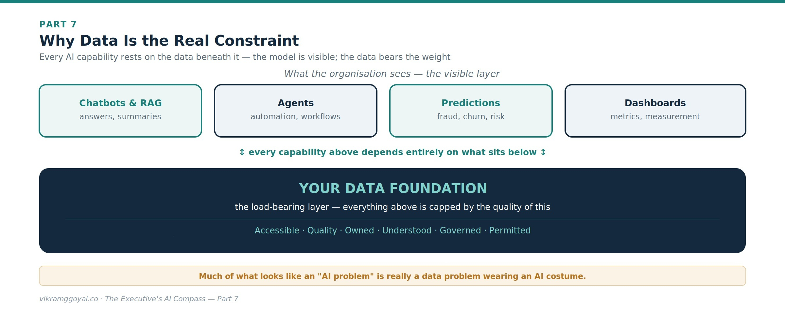
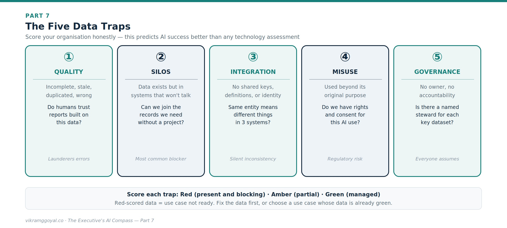



*Views are my own, not those of my employer or clients. Some specifics (model names, regulations) may date over time.*

In Part 6 we turned personal fluency into institutional capability - the operating model, the talent mix, and the roles that let an enterprise run AI at scale.

**The series map:**

- **[Part 1: Demystifying the Digital Brain](https://vikramggoyal.co/posts/executives-ai-compass-part-1/)**
- **[Part 2: The Mechanics of Prompting](https://vikramggoyal.co/posts/executives-ai-compass-part-2/)**
- **[Part 3: The Dawn of Agentic AI](https://vikramggoyal.co/posts/executives-ai-compass-part-3/)**
- **[Part 4: Architectural Fluency](https://vikramggoyal.co/posts/executives-ai-compass-part-4/)**
- **[Part 5: Leading Enterprise AI Projects](https://vikramggoyal.co/posts/executives-ai-compass-part-5/)**
- **[Part 6: The Operating Model](https://vikramggoyal.co/posts/executives-ai-compass-part-6/)**
- **Part 7: The Data Foundation** *(you are here)*
- **Part 8: When AI Joins the Management System**
- **Bonus: Downloadable Artefacts for Leading AI Projects**

Now we go beneath all of it. Every capability in this series - grounding a model in your knowledge, agents that act, predictions you can trust, dashboards that inform decisions - rests on one thing we have referenced at every turn but never fully addressed: your data.

---

## Part 7: The Data Foundation

Here is the uncomfortable truth that vendors rarely lead with: the single biggest predictor of whether your AI programme succeeds is not the model you choose, the consultancy you hire, or the size of your budget. It is the state of your data. A brilliant model on top of fragmented, ungoverned, low-quality data will produce fluent, confident, well-formatted and hallucinated nonsense - faster and at greater scale than you could before.

Strong AI systems require strong data foundations. This part is about building one.

## Why data is the real constraint

Think back through the series. Retrieval-augmented generation (Part 3) is only as good as the documents it can retrieve. An agent (Part 3) is only as safe as the access controls on the data it can reach. A predictive model (Part 1) is only as accurate as the history it learned from. Value measurement (Part 5) is impossible without trustworthy baseline data. In every case, the model is the visible part; the data is the load-bearing part.

{fig-alt="Diagram: why data is the real constraint - the visible layer of chatbots & RAG, agents, predictions, and dashboards rests on the load-bearing data foundation: accessible, quality, owned, understood, governed, permitted"}

This reframes your role. Much of what looks like an "AI problem" is really a data problem wearing an AI wrapper - and it is far cheaper to discover that before you have spent the budget than after.

## Assess your data culture: the five traps

Before readiness, look honestly at your organisation's relationship with data. Five recurring traps quietly sink AI initiatives:

{fig-alt="Diagram: the five data traps - quality, silos, integration, misuse, and governance - each scored red, amber, or green"}

- **Quality.** If humans don't trust a report built on this data, an AI won't fix that - it will launder the errors into confident prose.
- **Silos.** The single most common blocker: the data exists, but in a dozen systems that were never designed to be joined.
- **Integration.** Even unsiloed data resists use when "customer" means three different things in three systems, with no shared identifier.
- **Misuse.** Using data for AI beyond the purpose it was collected for is a fast route to a regulatory or trust breach (see Part 4).
- **Governance.** When no one owns a dataset, no one is accountable for its quality, its access, or its lifecycle - and everyone assumes someone else is.

An honest scoring of your organisation against these five is a better predictor of AI success than any technology assessment.

## What generative AI changes: unstructured data

For decades, "data strategy" meant structured data - the rows and columns in databases and warehouses that predictive analytics feeds on. But the large majority of enterprise knowledge has always lived in **unstructured** form: contracts, emails, policies, call transcripts, slide decks, PDFs, images.

Generative AI's breakthrough is that this unstructured material is now usable at scale - which is exactly why RAG matters. The implication for leaders: your data strategy can no longer stop at the warehouse. The messy document estate you have long ignored is now a strategic asset - and, if ungoverned, a strategic liability, because an AI can surface anything in it that isn't properly access-controlled.

## A data-readiness self-assessment

Before funding an AI use case, ask whether the data behind it clears six bars. Score each red / amber / green:

1. **Accessible** - can the team actually get to the data, in a usable form, without a six-month integration project?
2. **Quality** - is it complete, current, and accurate enough that a human would trust it?
3. **Owned** - is there a named owner (a data steward) accountable for it?
4. **Understood** - do we know its lineage: where it came from and how it's defined?
5. **Governed** - are access, retention, and permitted uses defined and enforced?
6. **Permitted** - do we have the rights and consent to use it for this purpose?

A use case sitting on red-scored data is not ready, however compelling the demo. The honest move is to fix the data first, or choose a use case whose data is already green.

## Building a data strategy AI can stand on

You don't need to personally architect a data platform. You do need to sponsor and hold your teams to a strategy with a few non-negotiables:

- **Single sources of truth.** Agree where the authoritative version of each key entity lives, so AI (and humans) stop reconciling three conflicting copies.
- **Ownership and stewardship.** Every important dataset gets a named owner accountable for its quality, access, and lifecycle. Governance is a role, not a document.
- **Quality pipelines.** Treat data quality as an ongoing, monitored process - not a one-off clean-up that decays the moment it finishes.
- **Access by least privilege.** The Part 4 rule, applied at the source: if a person isn't authorised to see it, the AI must not be able to either.
- **Lifecycle and retention.** Keep AI-facing data in sync with your deletion and retention obligations, so nothing lingers in an index past its lawful life.
- **Data as a product.** The most mature organisations treat well-governed, documented, accessible datasets as internal products with owners and consumers - which is precisely what makes them AI-ready.

Wrapped around all of this is the governance, compliance, and ethical frame from Part 4: quality, security, privacy, and permitted use are not separate from your data strategy - they are what makes it trustworthy enough to build on.

**The business impact:** Every hour and capital spent making data accessible, accurate, owned, and governed compounds across *every* AI use case you will ever run - while every use case built on a shaky foundation quietly borrows against your credibility. Data readiness is the least glamorous and highest-leverage investment - Fund it first.

---

## Key takeaways

- The biggest predictor of AI success is the **state of your data**, not only the model.
- Watch the **five traps**: quality, silos, integration, misuse, governance.
- Generative AI makes **unstructured data** (documents, email, calls) a strategic asset - and a liability if ungoverned.
- **Score data readiness before funding** (accessible, quality, owned, understood, governed, permitted) and treat data as a product.

## Your onboarding status

You can now tell the difference between an AI problem and a data problem wearing an AI wrapper - and you know that the value of everything else in this series is capped by the quality, accessibility, and governance of what sits underneath. You can hold your teams to a data-readiness bar before funding, and sponsor a strategy that makes the foundation stronger with every use case.

One frontier remains. So far, across seven parts, AI has been something your organisation *uses* - a tool that drafts, retrieves, predicts, and automates. But as these systems mature, they begin to do something more unsettling and more powerful: they start to help *manage and organise the work itself*.

In our finale, **Part 8: When AI Joins the Management System**, I would like to explore algorithmic management, the rise of human-and-machine "superminds," and how the job of leadership itself changes when AI moves from the toolbox into the management structure.

---

*This article is educational and does not constitute legal or financial advice. Data governance obligations vary by jurisdiction and sector - confirm specifics with qualified legal and data-protection professionals.*
